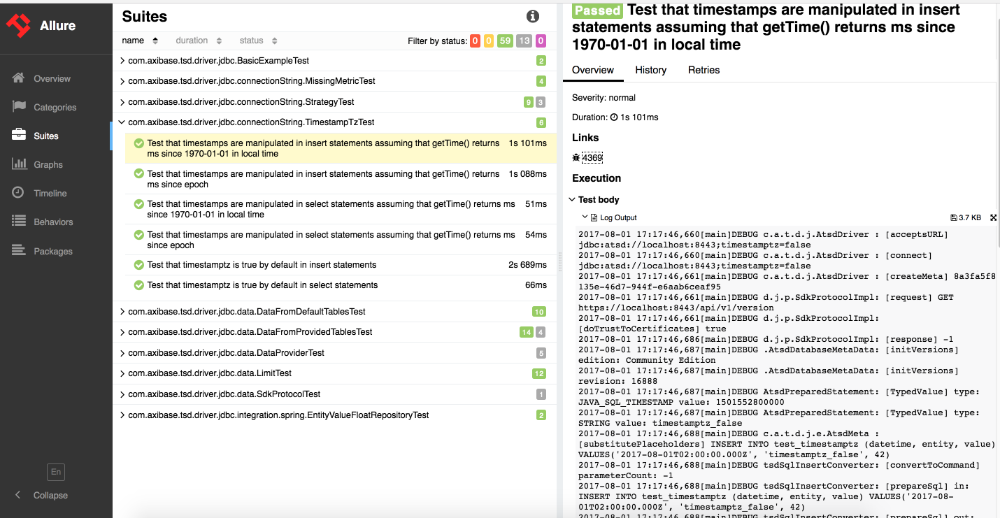

[](https://travis-ci.org/axibase/atsd-jdbc-test)
[](https://www.codacy.com/app/anton-rib/atsd-jdbc-test?utm_source=github.com&amp;utm_medium=referral&amp;utm_content=axibase/atsd-jdbc-test&amp;utm_campaign=Badge_Grade)
[](http://www.apache.org/licenses/LICENSE-2.0)
[](https://www.versioneye.com/user/projects/57b45deaf0b3bb00487de3a7)
# Integration tests for JDBC driver

- [Run tests with local ATSD](#run-tests-with-local-atsd)
- [Run tests with ATSD in a Docker container](#run-tests-with-atsd-in-a-docker-container)
## Requirements

* Java 1.8

## Run tests with local ATSD

```bash
$ mvn clean test
```
To run tests, you have to choose (or create) your own ATSD metrics. A test phase requires a set of test properties listed below. You need to fill the file `src/test/resources/dev.properties` with your metrics. The following properties are mandatory: 

```
axibase.tsd.driver.jdbc.url=<ATSD_URL | host:port | >
axibase.tsd.driver.jdbc.username=<ATSD_LOGIN>
axibase.tsd.driver.jdbc.password=<ATSD_PASSWORD>
axibase.tsd.driver.jdbc.metric.tiny=<TEST_METRIC_NAME>
axibase.tsd.driver.jdbc.metric.tiny.count=<TEST_METRIC_EXPECTED_RECORDS>
```
See also:

* [Custom JUnit Rules](#custom-junit-rules)
* [Exposed parameters](#exposed-parameters)
* [Generate report and run on localhost](#generate-report-and-run-on-localhost)

## Run tests with ATSD in a Docker container

The tests are built automatically by Travis CI, but you also can run it manually: launch run_tests_in_container.sh under root directory of atsd-jdbc-test 

```bash
./run_tests_in_container.sh DOCKER_PUBLISH_PORTS TEST_OPTIONS
```
> Note a set of test properties already specified, i.e. `src/test/resources/dev.properties` filled automatically

Parameter `DOCKER_PUBLISH_PORTS` is required, you can specify HTTPS and TCP ports or use "--publish-all" (in this case Docker finds free ports automatically):

```bash
./run_tests_in_container.sh "--publish-all"
./run_tests_in_container.sh "-p1234:8443 -p4321:8081"
```
`TEST_OPTIONS` is not required, but must be specified in double quotes in case of use, see [exposed parameters](#exposed-parameters).

> Before the start of the tests run_tests_in_container.sh launches ATSD instance with pre-installed m_small (100 samples), m_large (500 000 samples) metrics and user axibase:axibase

See also:

* [Custom JUnit Rules](#custom-junit-rules)
* [Exposed parameters](#exposed-parameters)
* [Generate report and run on localhost](#generate-report-and-run-on-localhost)

### Generate report and run on localhost

```bash
$ mvn allure:report jetty:run -Djetty.port=1234
```



### Custom JUnit Rules
* `OutputLogsToAllure(boolean enable)` -- redirect logging to allure attachments
* `SkipTestOnCondition` -- allows to skip test if required system variable is not set. Tests with required variables should be annotated with the `ExecuteWhenSysVariableSet` annotation which has a string parameter -- required system variable. This annotation is repeatable.

### Exposed parameters

The following parameters may be specified on test execution, for example:

```bash
mvn clean test -Dinsert.wait=500
```
```bash
./run_tests_in_container.sh "--publish-all" "-Dinsert.wait=500 -Doutput.redirect.allure=true"
```

Parameter | Supported Values | Example Value | Description
------------|-------------|------------|-----------
output.redirect.allure | true or not set | true | Redirect per-test execution logging to allure attachment. Works only for tests with [OutputLogsToAllure](#custom-junit-rules) rule enabled
allure.link.issue.pattern | string with `{}` placeholder | https://localhost/redmine/issues/{} | Pattern for generating links to bugtracking system
insert.wait | integral number, default is 1000 | 5000 | waiting timeout in ms between insert and subsequent select statement 
